# PAI Data Flow Diagrams

**Purpose:** Visual representation of how data moves through the PAI system
**Audience:** Developers, system administrators
**Last Updated:** February 4, 2026

---

## Complete System Data Flow

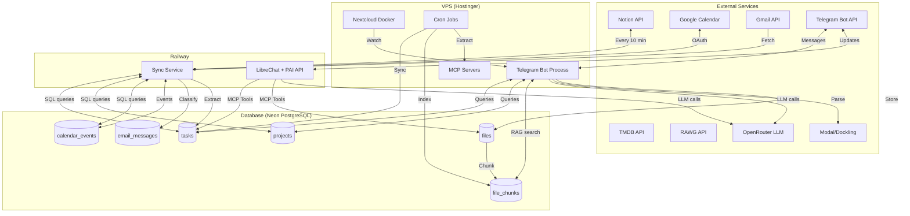

---

## Task Creation Flow

### Via Telegram

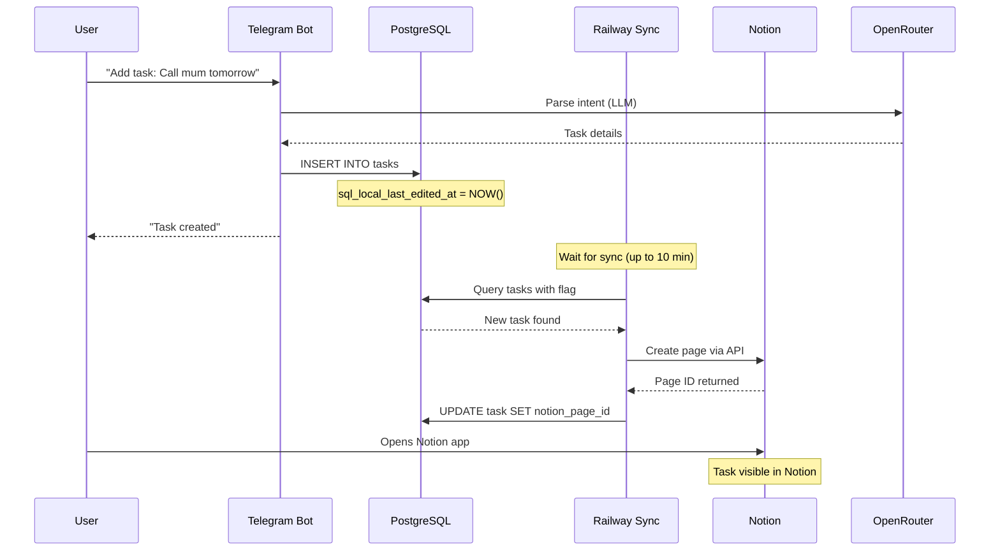

### Via Notion

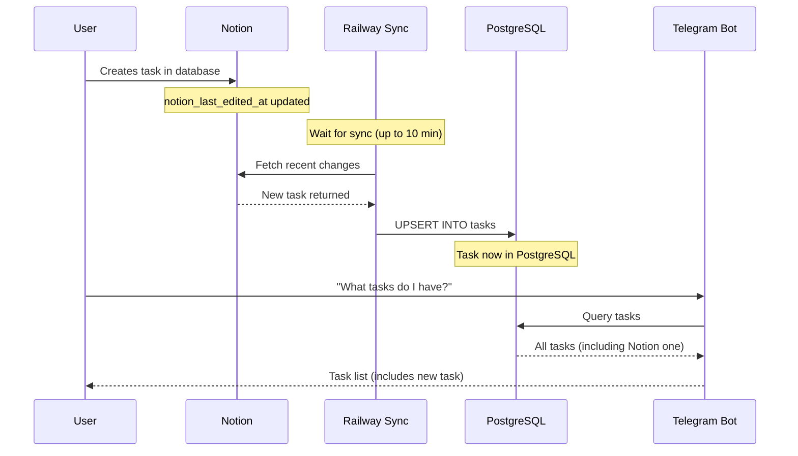

---

## File Processing Pipeline

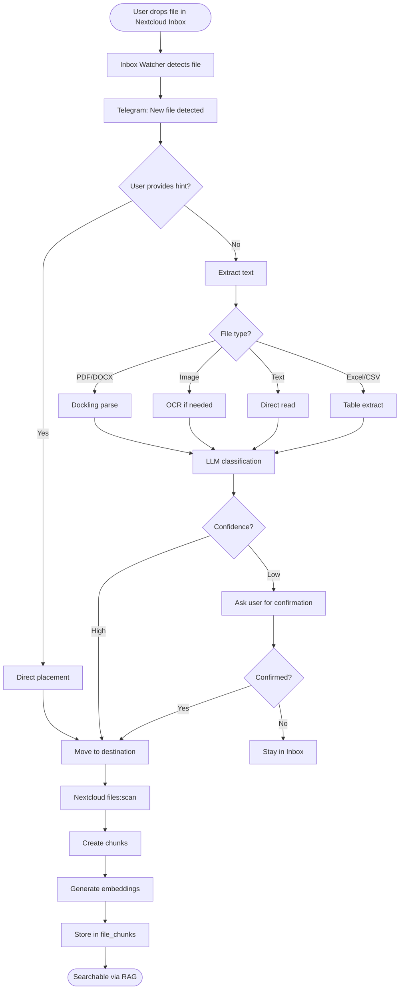

---

## Email Classification Flow

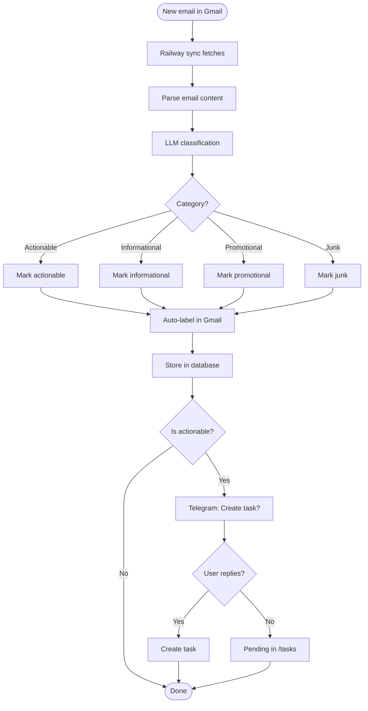

---

## Meeting Recording Pipeline

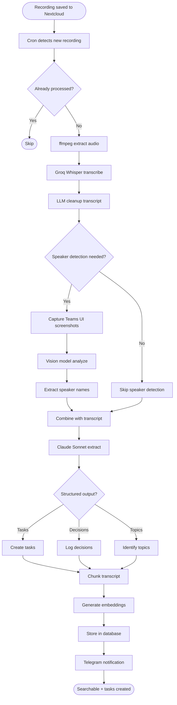

---

## Bidirectional Sync (Notion ↔ PostgreSQL)

### Inbound: Notion → PostgreSQL

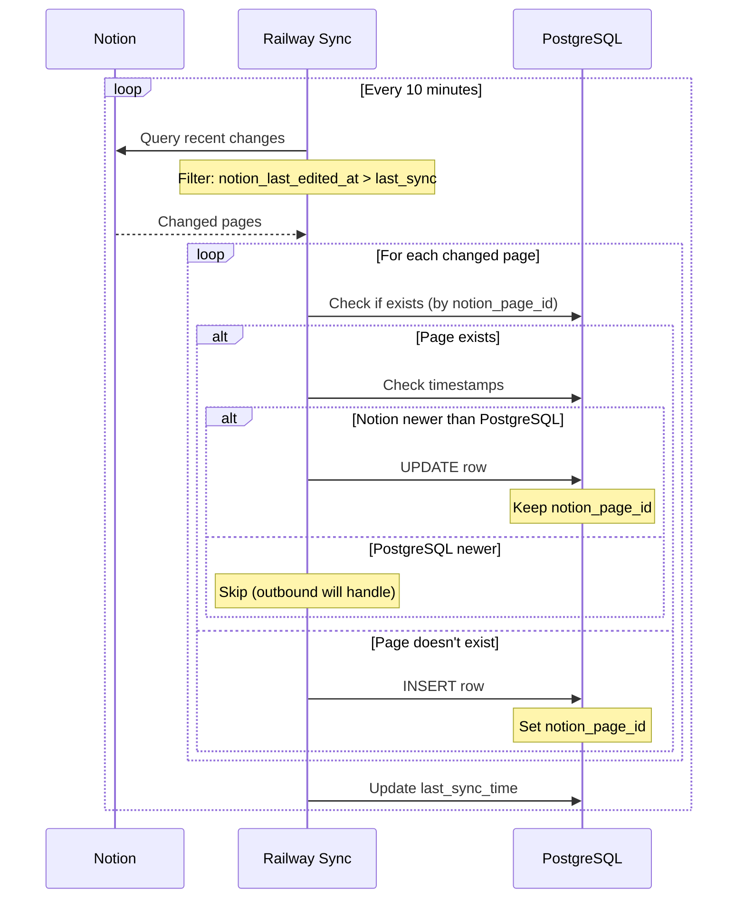

### Outbound: PostgreSQL → Notion

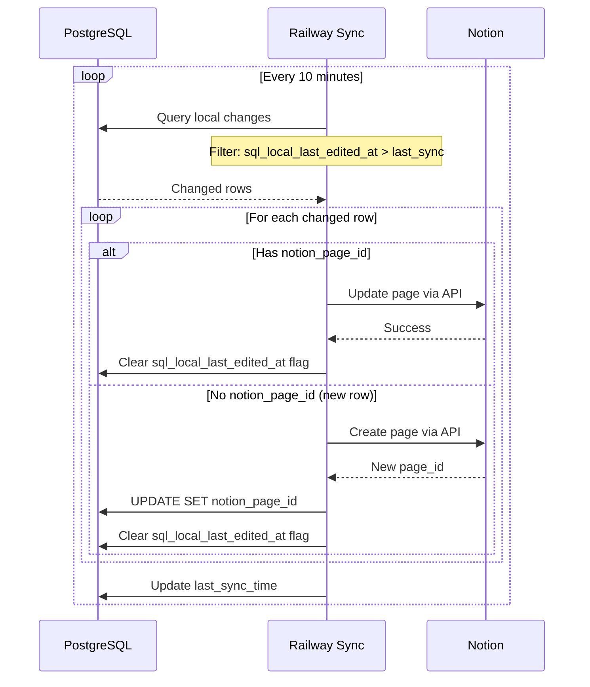

### Conflict Resolution

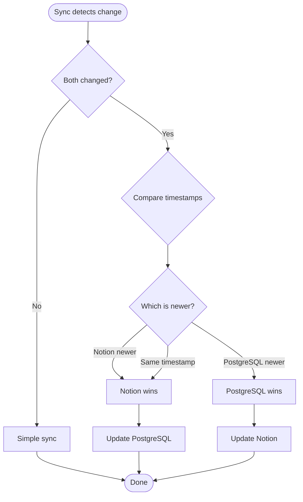

**Note:** True conflicts (both edited at nearly same time) are rare because:
- User typically edits in ONE place at a time
- 10-minute sync window is short
- Last-write-wins strategy is acceptable for personal use

---

## RAG Search Flow

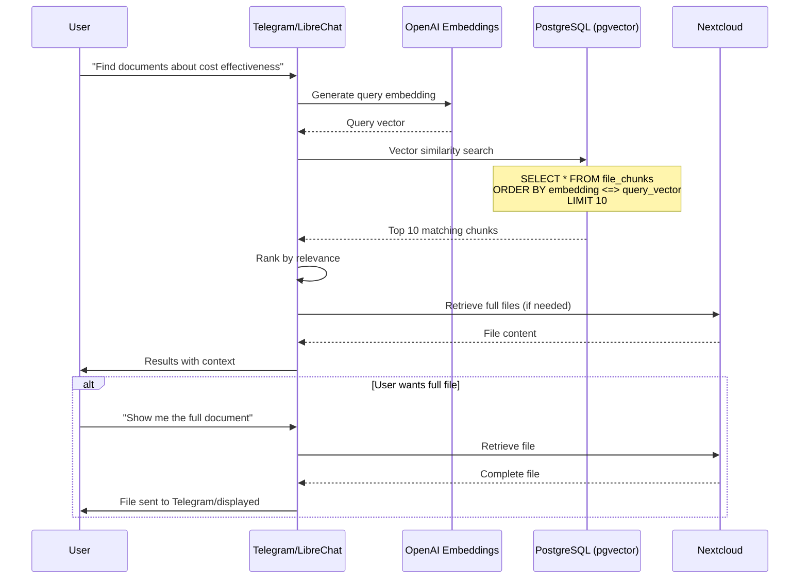

---

## Scheduled Notification Flow

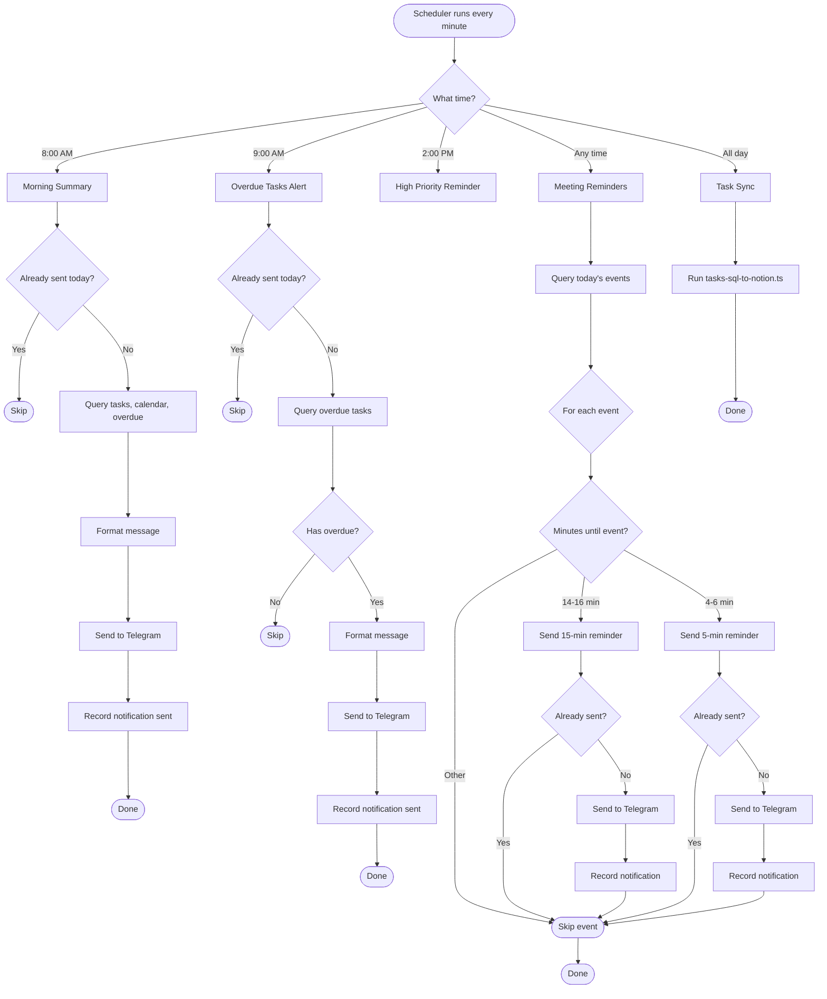

---

## MCP Tool Call Flow (LibreChat)

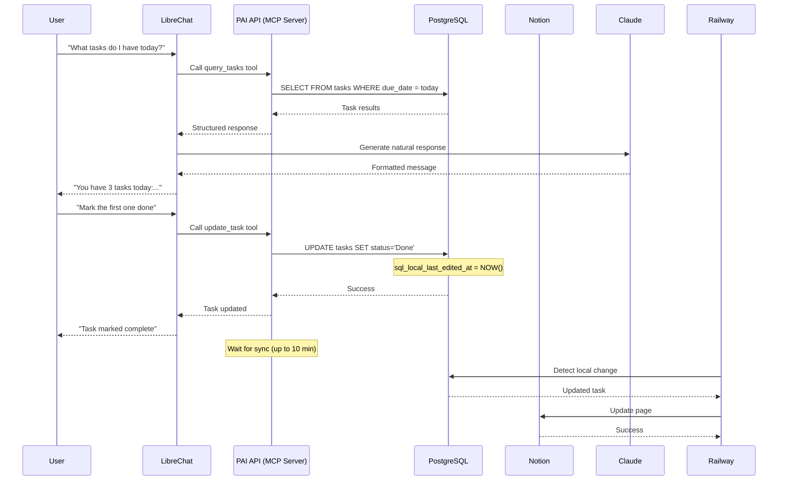

---

## Data Persistence Layers

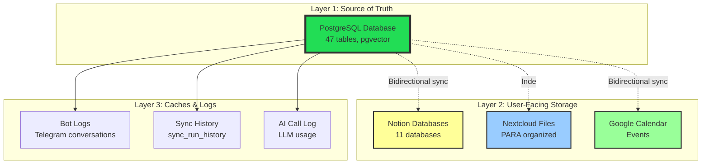

**Key Principles:**
1. **PostgreSQL is source of truth** - All interfaces read/write here first
2. **External services sync bidirectionally** - Changes flow both ways
3. **Sync is eventual** - Max 10-minute lag
4. **Conflicts resolved by timestamp** - Last write wins
5. **All data versioned** - Can trace changes via logs

---

## Related Documentation

- [System Overview](system-overview.md) - High-level architecture
- [Notion Sync](../02-capabilities/notion-sync.md) - Detailed sync mechanics
- [File Processing](../02-capabilities/file-processing.md) - File pipeline details
- [Email System](../02-capabilities/email-system.md) - Email processing flow

---

**Last Updated:** February 4, 2026
**Diagrams:** Mermaid format (render in compatible viewer)
